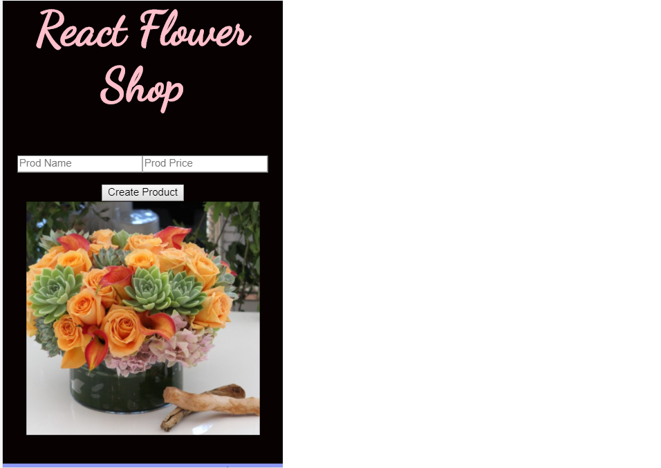
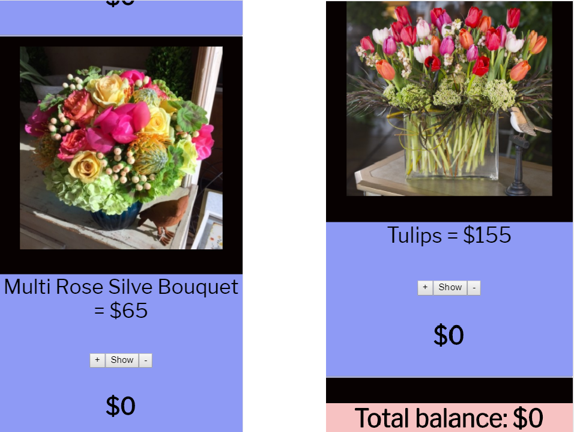
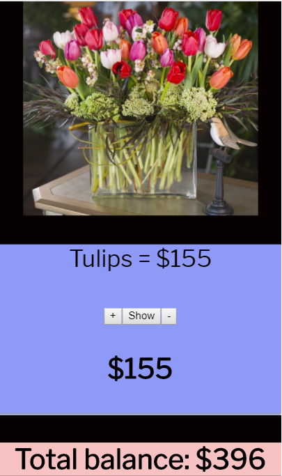

This project was bootstrapped with [Create React App](https://github.com/facebookincubator/create-react-app).

Below you will find some information on how to perform common tasks.<br>
You can find the most recent version of this guide [here](https://github.com/facebookincubator/create-react-app/blob/master/packages/react-scripts/template/README.md).

This is a basic app done in react to show the point of sale.

### FEATURES
* add products to cart
* total products
* small description of each product

### FOLDER STRUCTURE

```
class Product extends Component { constructor(props) {   
    super(props);   
        this.state = {qty:0};   
        this.buy = this.buy.bind(this);  
        this.show =this.show.bind(this);   
        this.minus =this.minus.bind(this); }
```

This is the first page.



This part shows items plus total. 



This last part shows the total amount that was purchased.


## LINK

http://dea-react-shoppingcart.herokuapp.com/

